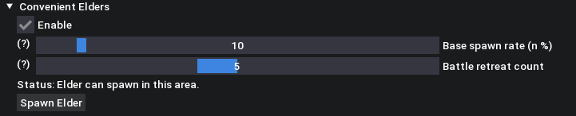

# MHST3 Convenient Elders

This script contains a rework of the "Force same area elder?" feature where its now a button to spawn it in the current area youre standing in.

Initially created by [@f4iTh](https://github.com/f4iTh)

---

Makes calamitous elder dragon spawning much more convenient compared to the base/vanilla game.

## Features

- Adjust elder dragon spawn chance between 0 - 100%

  - Default: 10%
- Adjust elder dragon despawn/retreat rate (= how many battles until it leaves) between 1 and 10 (battles)

  - Default: 5 (battles)
- Manually spawn the Elder associated with your current region (also tp's you to nearest caravan and sets time to night)
